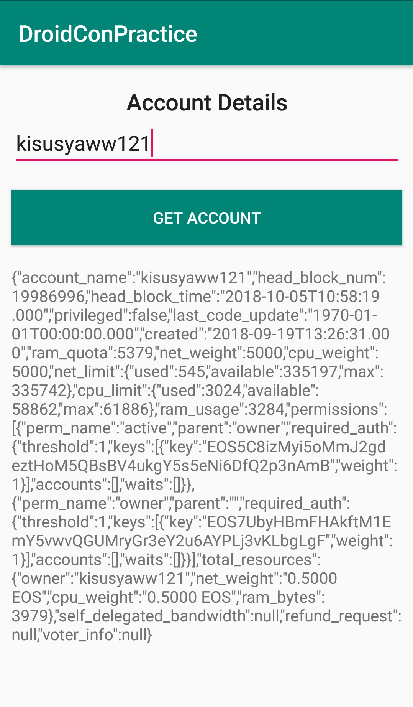

# DroidConKE

Source code for the DroidConKE

What we will end up with

<p >
	
</p>

## Step 1

Create new Android Studio project with an empty activity

## Step 2

Add the following dependencies in the build.gradle(Module:app)

Gson converter will not be used in this demo at the moment because we are displaying the raw response in string format

Converter-scalars -> Displays the response from the server as a string

```
// Retrofit

implementation 'com.squareup.retrofit2:retrofit:2.3.0'
implementation 'com.squareup.retrofit2:converter-gson:2.2.0'
implementation 'com.squareup.retrofit2:converter-scalars:2.3.0'
```

## Step 3

Add internet permissions in the AndroidManifest.xml (just after the manifest file)

```
    <uses-permission android:name="android.permission.INTERNET" />
```

## Step 4

We need to create a package called api and an java class called Api

```
    -com.example.peter.droidconpractice
    ---api(package)
    -----Api(java class)
```

## Step 5

We now create the api interface where we can do http requests such as POST, PUT and DELETE

We need a url to fetch data from, in this case we use the eosnairobi node api https://mainnet.eosnairobi.io/

NB: Base url has been hard coded in the Main Activity and also in the Api which is not best practice

Okttp3 is what retrofit uses to make requests, in this case, it's get_account https://developers.eos.io/eosio-nodeos/reference

```
package com.kotani.eosaccounts.Api;

import com.google.gson.JsonObject;

import java.util.List;

import okhttp3.RequestBody;
import okhttp3.ResponseBody;
import retrofit2.Call;
import retrofit2.http.Body;
import retrofit2.http.POST;

public interface Api {

    String BASE_URL = "https://mainnet.eosnairobi.io/";

    @POST("/v1/chain/get_account")
    Call<ResponseBody> getAccount(@Body RequestBody params);

}
```

## Step 6

We create the layout for our application. A title, a text field for entering account names, a button, when clicked fetches all information about a given account and a text field to present the output.

```
<LinearLayout
        android:layout_width="match_parent"
        android:layout_height="match_parent"
        android:orientation="vertical">

        <TextView
            android:layout_width="match_parent"
            android:layout_height="wrap_content"
            android:gravity="center_horizontal"
            android:text="@string/account_details"
            android:layout_marginTop="18dp"
            android:textAppearance="@style/TextAppearance.AppCompat.Title"/>
        <EditText
            android:layout_width="match_parent"
            android:layout_height="wrap_content"
            android:hint="@string/hint"
            android:layout_marginLeft="10dp"
            android:layout_marginRight="10dp"
            android:inputType="textMultiLine"
            android:id="@+id/account_name" />
        <Button
            android:layout_width="match_parent"
            android:layout_height="wrap_content"
            android:layout_marginTop="18dp"
            android:background="@color/colorPrimary"
            android:layout_marginLeft="10dp"
            android:layout_marginRight="10dp"
            android:id="@+id/get_account"
            android:text="@string/get_account"
            android:textColor="@android:color/white"
            />
        <TextView
            android:layout_marginTop="18dp"
            android:layout_width="match_parent"
            android:layout_height="wrap_content"
            android:id="@+id/info"
            android:layout_marginRight="10dp"
            android:layout_marginLeft="10dp"
            />

    </LinearLayout>
```

## Step 7

Go to the MainActivity, assing variables to the respective widgets in the user interface and try to obtain the input value of the account name on the input text field

```
TextView info;

    @Override
    protected void onCreate(Bundle savedInstanceState) {
        super.onCreate(savedInstanceState);
        setContentView(R.layout.activity_main);

        info = (TextView) findViewById(R.id.info);
        final EditText nameTxt = (EditText) findViewById(R.id.account_name);
        Button getAccount = (Button) findViewById(R.id.get_account);

        // Call method to get the account details
        getAccount.setOnClickListener(new View.OnClickListener() {
            @RequiresApi(api = Build.VERSION_CODES.KITKAT)
            @Override
            public void onClick(View view) {
                String name = nameTxt.getText().toString().trim();
                if(!TextUtils.isEmpty(name)) {
                    getAccount(name);
                }
            }
        });
    }
```

Ensure you have this imports from Retrofit

```
import com.example.peter.droidconpractice.api.Api; // Change this do not copy paste!

import org.json.JSONObject;

import java.util.Map;

import okhttp3.RequestBody;
import okhttp3.ResponseBody;
import retrofit2.Call;
import retrofit2.Callback;
import retrofit2.Retrofit;
import retrofit2.converter.scalars.ScalarsConverterFactory;
```

We now send a post request to the node api and output the response

```
private void getAccount(String account_name){

        // Url builder
        Retrofit retrofit = new Retrofit.Builder()
                .addConverterFactory(ScalarsConverterFactory.create())
                .baseUrl("https://mainnet.eosnairobi.io/")
                .build();

        // Call the api class
        Api api = retrofit.create(Api.class);
        Map<String, Object> jsonParams = new ArrayMap<>();
        jsonParams.put("account_name", account_name);

        RequestBody body = RequestBody.create(okhttp3.MediaType.parse("application/json; charset=utf-8"),(new JSONObject(jsonParams)).toString());
        Call<ResponseBody> response = api.getAccount( body);
        response.enqueue(new Callback<ResponseBody>()
        {
            @Override
            public void onResponse(Call<ResponseBody> call, retrofit2.Response<ResponseBody> rawResponse)
            {
                try
                {
                    //get your response....
                    info.setText(rawResponse.body().string());
                }
                catch (Exception e)
                {
                    e.printStackTrace();
                    Toast.makeText(getApplicationContext(),"Ummm... Sticks and Stones, friend. Try Again.", Toast.LENGTH_SHORT).show();
                }
            }

            @Override
            public void onFailure(Call<ResponseBody> call, Throwable throwable)
            {
                info.setText(throwable.getMessage());
                Toast.makeText(getApplicationContext(),"Your Mental is Flawed. A Psycho in commom-man settings. Try Again.", Toast.LENGTH_SHORT).show();
            }
        });

    }
```

In short we are trying to do this

```
curl --request POST   --url http://mainnet.eosnairobi.io/v1/chain/get_account   --data '{"account_name":"kisusyaww121"}'
```

To get this output

```
{
   "account_name":"kisusyaww121",
   "head_block_num":19981738,
   "head_block_time":"2018-10-05T10:14:30.000",
   "privileged":false,
   "last_code_update":"1970-01-01T00:00:00.000",
   "created":"2018-09-19T13:26:31.000",
   "ram_quota":5379,
   "net_weight":5000,
   "cpu_weight":5000,
   "net_limit":{
      "used":545,
      "available":335194,
      "max":335739
   },
   "cpu_limit":{
      "used":3024,
      "available":58862,
      "max":61886
   },
   "ram_usage":3284,
   "permissions":[
      {
         "perm_name":"active",
         "parent":"owner",
         "required_auth":{
            "threshold":1,
            "keys":[
               {
                  "key":"EOS5C8izMyi5oMmJ2gdeztHoM5QBsBV4ukgY5s5eNi6DfQ2p3nAmB",
                  "weight":1
               }
            ],
            "accounts":[

            ],
            "waits":[

            ]
         }
      },
      {
         "perm_name":"owner",
         "parent":"",
         "required_auth":{
            "threshold":1,
            "keys":[
               {
                  "key":"EOS7UbyHBmFHAkftM1EmY5vwvQGUMryGr3eY2u6AYPLj3vKLbgLgF",
                  "weight":1
               }
            ],
            "accounts":[

            ],
            "waits":[

            ]
         }
      }
   ],
   "total_resources":{
      "owner":"kisusyaww121",
      "net_weight":"0.5000 EOS",
      "cpu_weight":"0.5000 EOS",
      "ram_bytes":3979
   },
   "self_delegated_bandwidth":null,
   "refund_request":null,
   "voter_info":null
}
```

We get then get the response displayed on the mobile app

## NB

Depending on the type of data you are fetching from the blockchain, the other requests one can make are:
In this case, observables are used in the requests

```
    @POST("/v1/chain/{infoType}")
    Observable<EosChainInfo> readInfo(@Path("infoType") String infoType);

    @POST("/v1/chain/get_account")
    Observable<JsonObject> getAccountInfo(@Body AccountInfoRequest body);

    @POST("/v1/chain/get_table_rows")
    Observable<JsonObject> getTable(@Body GetTableRequest body);

    @POST("/v1/chain/push_transaction")
    Observable<PushTxnResponse> pushTransaction(@Body PackedTransaction body);

    @POST("/v1/chain/push_transaction")
    Observable<JsonObject> pushTransactionRetJson(@Body PackedTransaction body);

    @POST("/v1/chain/get_required_keys")
    Observable<RequiredKeysResponse> getRequiredKeys(@Body GetRequiredKeys body);


    @POST("/v1/chain/get_currency_balance")
    Observable<JsonArray> getCurrencyBalance(@Body GetBalanceRequest body);

    @POST("/v1/chain/get_currency_stats")
    Observable<JsonObject> getCurrencyStats(@Body GetRequestForCurrency body);


    @POST("/v1/chain/abi_json_to_bin")
    Observable<JsonToBinResponse> jsonToBin(@Body JsonToBinRequest body);

    @POST("/v1/chain/get_code")
    Observable<GetCodeResponse> getCode(@Body GetCodeRequest body);

    @POST("/v1/history/get_controlled_accounts")
    Observable<JsonObject> getServants(@Body JsonObject body);

    @POST("/v1/history/get_transactions")
    Observable<JsonObject> getTransactions( @Body JsonObject body);
```

## References

Tutorial on using Retrofit https://code.tutsplus.com/tutorials/sending-data-with-retrofit-2-http-client-for-android--cms-27845
Github repo, a demo application illustrating all api interactions with eos https://github.com/playerone-id/EosCommander
